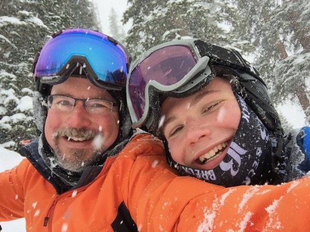

```{r setup, echo=FALSE, include=FALSE}
knitr::opts_chunk$set(echo = TRUE)
knitr::opts_chunk$set(fig.path="figures/", fig.width=6.5, fig.height=4, fig.align="center")
if (!require("tidyverse")) install.packages("tidyverse"); library(tidyverse)
```

## Example Figure

```{r sepal-width-length, fig.cap='Relation between sepal width and length in three species of _Iris_.'}
library(tidyverse)
iris %>%
ggplot(aes(x = Sepal.Width, y = Sepal.Length, color = Species)) +
geom_point() 
```

## Including Graphics

```{r iris-picture} 
 
```

## Tables

```{r iris-table} 
iris %>%
  group_by(Species) %>% summarize(sepal_length = mean(Sepal.Length), sepal_width = mean(Sepal.Width)) %>% 
  knitr::kable(caption = "Mean sepal width and length for three species of _Iris_.") 
```


# Justin Koss

## My Results