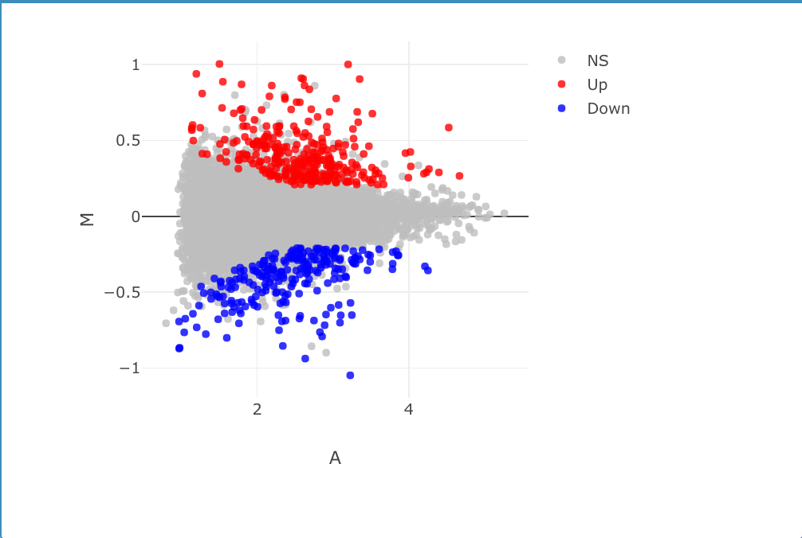

```{r setup, echo=FALSE, include=FALSE}
knitr::opts_chunk$set(echo = TRUE)
knitr::opts_chunk$set(fig.path="figures/", fig.width=6.5, fig.height=4, fig.align="center")
if (!require("tidyverse")) install.packages("tidyverse"); library(tidyverse)
```

## Example Figure

```{r sepal-width-length, fig.cap='Relation between sepal width and length in three species of _Iris_.'}
library(tidyverse)
iris %>%
ggplot(aes(x = Sepal.Width, y = Sepal.Length, color = Species)) +
geom_point() 
```

## Including Graphics

```{r iris-picture} 
 
```

## Tables

```{r iris-table} 
iris %>%
  group_by(Species) %>% summarize(sepal_length = mean(Sepal.Length), sepal_width = mean(Sepal.Width)) %>% 
  knitr::kable(caption = "Mean sepal width and length for three species of _Iris_.") 
```


# Justin Koss

## My Results

=======

#Megan Ritter

##My results
Here is where I can describe the results
```{r iris-picture} 
knitr::include_graphics("figures/Ritter_DEBrowser_image.png") 
```

# Jordan Simpson

I'm updating my own section. My pipeline was Kallisto-Limma, and as you can see, I have a single down-regulated gene.

```{r downregulated gene-picture} 
knitr::include_graphics("figures/Simpson.png") 
```

```{r}
read.csv("tables/SimpsonTable.csv", header=TRUE) 
```


# Julie


# Katie Edwards

# Emily Konishi

# Matt McGauley

```{r figure} 
 
```

```{r data table}
read.csv("tables/Bowtie2EdgeR_McGauley.csv", header=TRUE) 
```


# Cheyenne McKinley

# Cheyenne Moore
```{r downregulated gene-picture} 
knitr::include_graphics("figures/Bowtie_limma_MA_Moore.png") 
```
```{r}
read.csv("tables/Moore_bowtie_limma.csv", header=TRUE)
```


# Chad Sussman

# Ian Vogel

# Katie Bille
