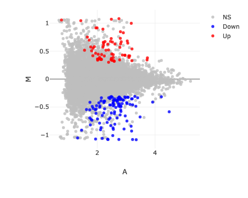
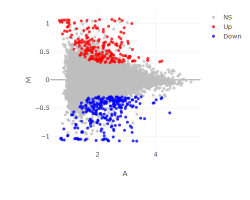
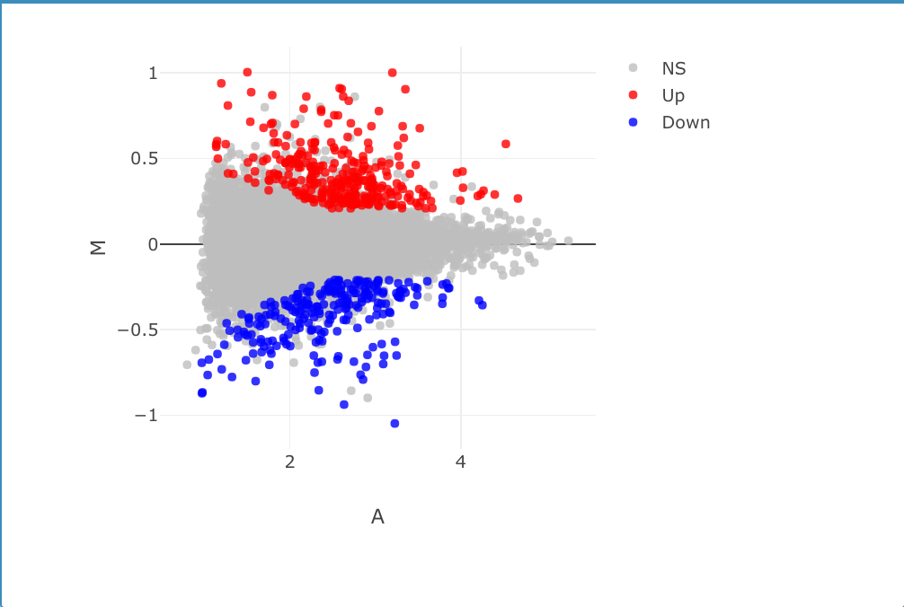
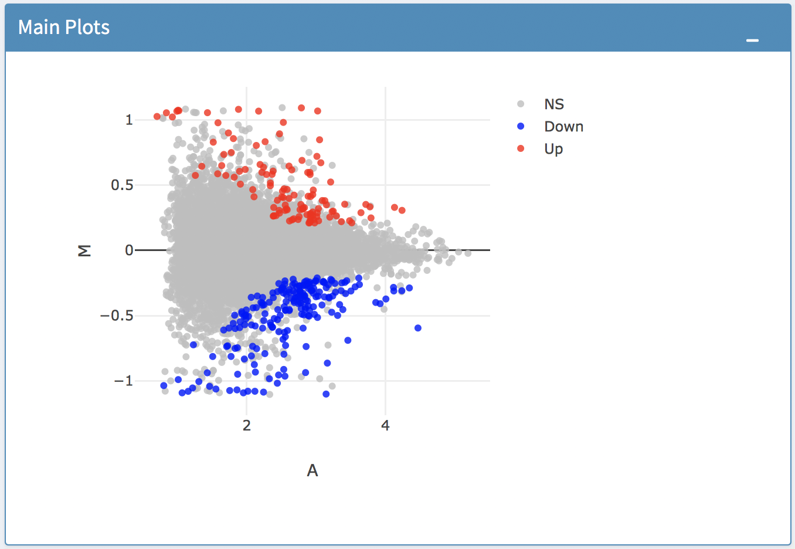
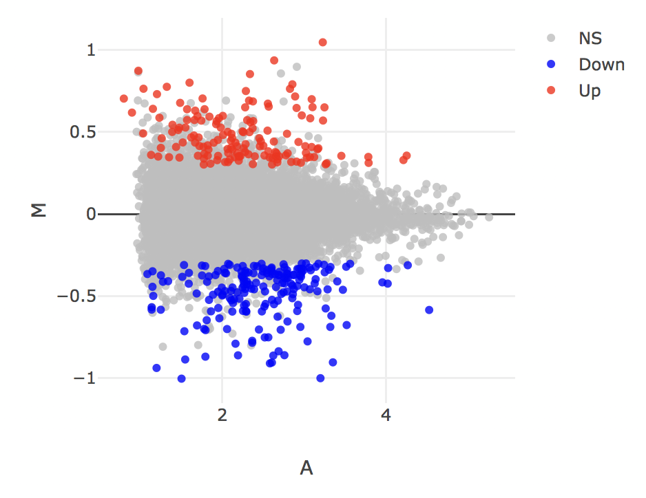
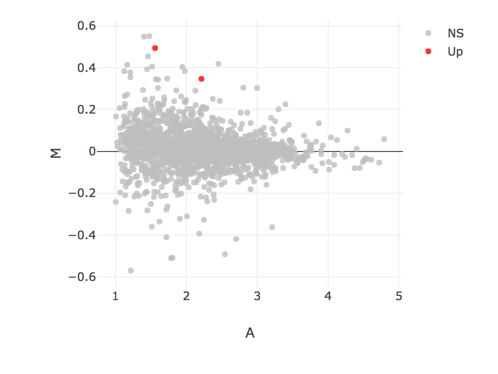
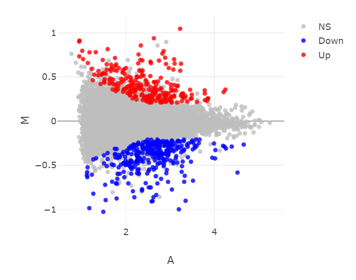
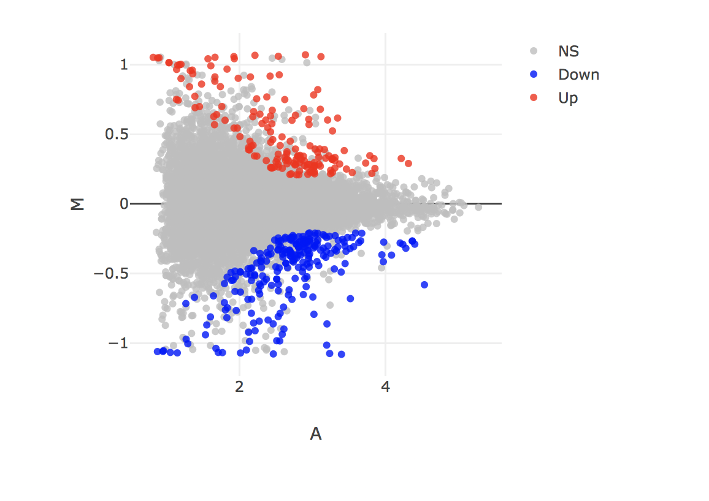
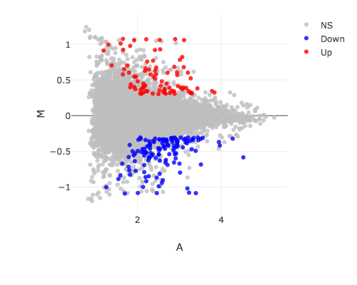

```{r setup, include=FALSE}
knitr::opts_chunk$set(echo = TRUE)
```

## R Markdown

#Bowtie

##limma

##DESeq
##EdgR

#Kallisto
=======

=======

```{r}
bowtie_limma_MA <-  
```

##DESeq
```{r}
bowtie_deseq_MA <-  
```

##EdgR
```{r}
bowtie_edgr_MA <-  
```


##All Bowtie
```{r}
bowtie_limma_MA
bowtie_deseq_MA
bowtie_edgr_MA

all_bowtie<- c(bowtie_limma, bowtie_deseq, bowtie_edgr)

all_bowtie
```


#Kallisto - Jordan


##limma
##DESeq
##EdgR


=======
```{r Kallisto figures} 
kallisto_limma_MA<- knitr::include_graphics("figures/Simpson.png") 
kallisto_edgeR_MA<- 
```

```{r}
kallisto_edgeR_MA
kallisto_limma_MA

all_kallisto_MA<- c(kallisto_edgeR_MA, kallisto_limma_MA)
```


#Salmon

##limma
##DESeq
##EdgR


#SailFish

=======
```{r Salmon Figures} 

 
 
```

#SailFish


```{r sailfish figures}
 
 
knitr::include_graphics("figures/") 
```


##limma
##DESeq
##EdgR


Possibly helpful links
https://stackoverflow.com/questions/3668102/plotting-several-jpeg-images-in-a-single-display
http://rforbiochemists.blogspot.com/2016/05/working-with-multiple-image-files.html