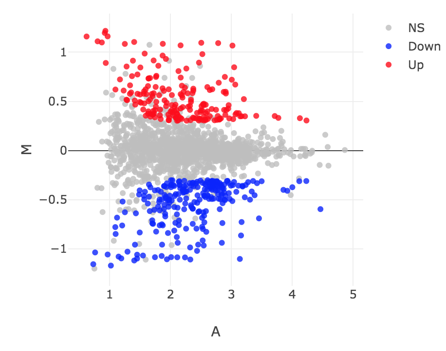
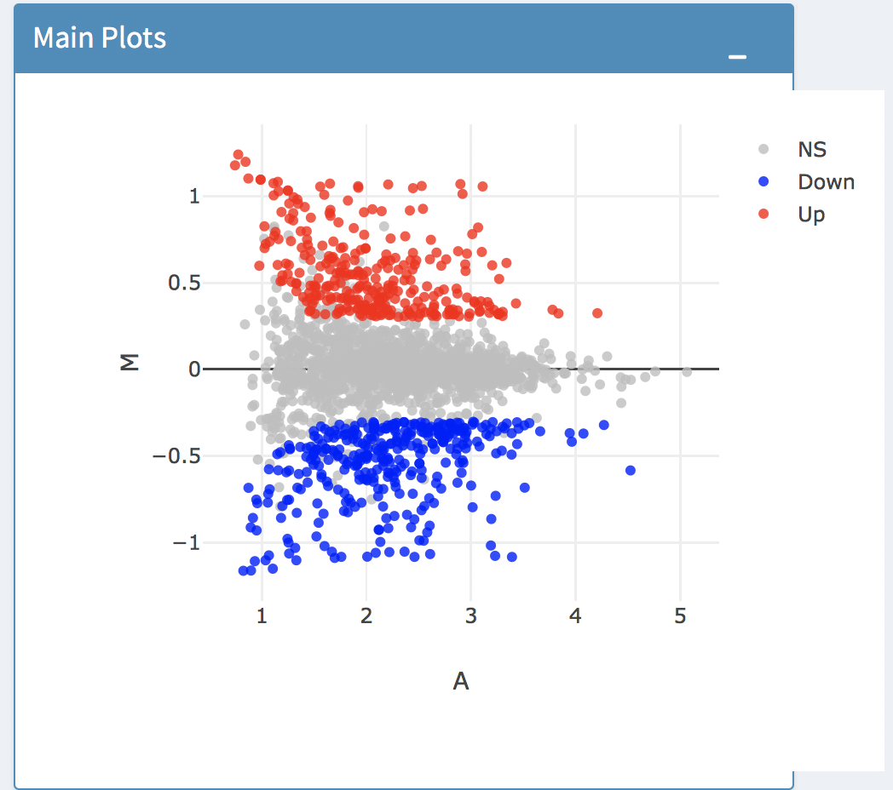

```{r setup, include=FALSE}
knitr::opts_chunk$set(echo = TRUE)
```

## R Markdown


#Bowtie- Cheyenne


##limma
```{r}
bowtie_limma_MA <- knitr::include_graphics("figures/Bowtie_limma_MA_Moore.png") 
```

##DESeq
```{r}
bowtie_deseq_MA <- knitr::include_graphics("figures/bowtie2_deseq2_maplot.png") 
```

##EdgR
```{r}
bowtie_edgr_MA <- knitr::include_graphics("figures/Bowtie2EdgeR_McGauley.png") 
```


##All Bowtie
```{r}
bowtie_limma_MA
bowtie_deseq_MA
bowtie_edgr_MA

all_bowtie<- c(bowtie_limma, bowtie_deseq, bowtie_edgr)

all_bowtie
```

#Kallisto - Jordan
##limma
##DESeq
##EdgR

```{r Kallisto MA plot figures} 
kallisto_limma_MA<- knitr::include_graphics("figures/Simpson.png") 
kallisto_edgeR_MA<- knitr::include_graphics("figures/MA_kallisto_edgeR.png")
kallisto_DESeq_MA<- 
```

```{r Kallisto MA plot figures part 2}
kallisto_edgeR_MA
kallisto_limma_MA
kallisto_DESeq_MA

all_kallisto_MA<- c(kallisto_edgeR_MA, kallisto_limma_MA, kallisto_DESeq_MA)
```

#Salmon

##limma
##DESeq
##EdgeR

```{r Salmon Figures} 
salmon_limma_MA <- knitr::include_graphics("figures/McKinleySalmonLimmaMAPlot.png")
salmon_deseq2_MA <- knitr::include_graphics("figures/salmon_deseq2_maplot.png") 
salmon_edgeR_MA <- knitr::include_graphics("figures/KE_Salmon_EdgeR_MAPlot.png") 

all_salmon_MA <- c(salmon_limma_MA,salmon_deseq2_MA,salmon_edgeR_MA)
```

#SailFish

```{r sailfish figures}
sailfish_EdgeR_MA <- knitr::include_graphics("figures/JustinKoss.sailfish.edgeR.png") 
sailfish_limma_MA <- knitr::include_graphics("figures/Ritter_DEBrowser_image.png") 
sailfish_DESeqw_MA <-  
sailfish_EdgeR_MA
sailfish_limma_MA
sailfish_DESeq2_MA
```


##limma
##DESeq
##EdgR


Possibly helpful links
https://stackoverflow.com/questions/3668102/plotting-several-jpeg-images-in-a-single-display
http://rforbiochemists.blogspot.com/2016/05/working-with-multiple-image-files.html