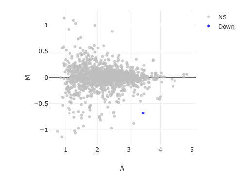

```{r setup, include=FALSE}
knitr::opts_chunk$set(echo = TRUE)
```

## R Markdown

#Bowtie- Cheyenne

##limma
```{r}
knitr::include_graphics("figures/Bowtie_limma_MA_Moore.png") 
```

##DESeq
```{r}
knitr::include_graphics("figures/bowtie2_deseq2_maplot.png") 
```


##EdgR
```{r bowtie edgr}
knitr::include_graphics("figures/Bowtie2EdgeR_McGauley.png") 
```

##All Bowtie
```{r}
knitr::include_graphics("figures/Bowtie_limma_MA_Moore.png") 
knitr::include_graphics("figures/bowtie2_deseq2_maplot.png") 
knitr::include_graphics("figures/Bowtie2EdgeR_McGauley.png") 
```


#Kallisto - Jordan

##limma 
##DESeq
##EdgR

```{r kallisto limma-ma plot} 
 
```


#Salmon

##limma
```{r Salmon and Limma MA Plot} 
knitr::include_graphics("figures/McKinleySalmonLimmaMAPlot.png")
```
##DESeq
##EdgR
```{r Salmon EdgeR MA Plot} 
knitr::include_graphics("figures/KE_Salmon_EdgeR_MAPlot.png") 
```

#SailFish

##limma
##DESeq
##EdgR

https://stackoverflow.com/questions/3668102/plotting-several-jpeg-images-in-a-single-display